# 2026 年 AI 工程报告（中文翻译）

> 译自 Amplify Partners 博客：[The 2026 AI Engineering Report](https://www.amplifypartners.com/blog-posts/the-2026-ai-engineering-report)
> 由 Amplify Partners 联合 Notion 与 Vercel 出品

我们与 Notion 和 Vercel 合作，调研了超过 1,000 名从事 AI 开发的工程师，内容涵盖他们正在使用哪些模型、如何看待成本，以及非技术同事是否已经在上线功能。当然，还有他们是否认为我们会把 GPU 送上太空。

一些重点：

* **图像生成之年**：图像类生成式 AI 的增速超过了所有其他模态，终于步入正轨……但音频仍是潜力股
* **开放权重模型受欢迎，但尚不能自给自足**：近一半的受访者在使用开放权重模型，但几乎都是与闭源模型搭配使用
* **一波标准化浪潮可能正在形成**：超过 50% 的受访者表示，其组织内部至少出现了向更少 AI 工具收敛的标准化趋势
* **成本已从脚注变为首要驱动因素**：四分之三的受访者会根据成本调整 AI 使用方式，40% 表示成本经常影响他们使用 AI 的"雄心程度"
* **这是 Agent 写入数据的一年**：在使用 Agent 的团队中，拥有写权限的比例从去年的 52% 上升到今年的 89%！而且由于使用 Agent 的团队整体大幅增加，使用具备写权限 Agent 的受访者占比比去年增长了 3 倍以上。但对于如何正确监控它们、设置护栏，业界尚无共识。

还有更多内容。废话不多说，让我们开始吧。

## 人口统计 / 我们调研了谁

到底是谁在做 AI 的工程侧工作？受访者中最大的群体自称是创始人或 AI 工程师（swyx 时刻）。

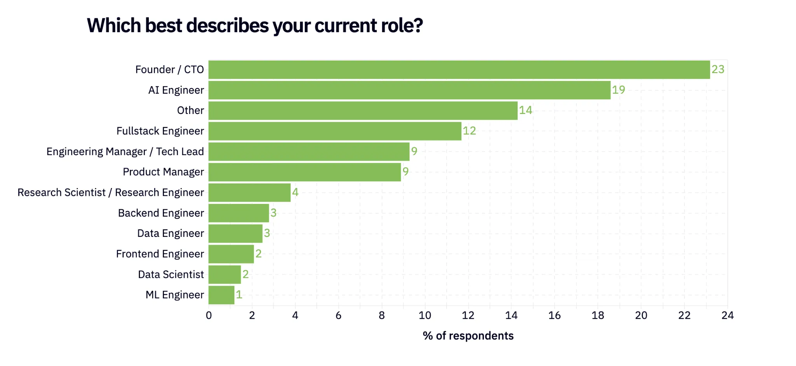

连续第三年，许多最资深的开发者其实是 AI 领域的相对新人：在拥有 10 年以上软件经验的受访者中，51% 的人 AI 经验不超过 3 年。

与此同时，前沿正在拉平：AI 经验不足 1 年的受访者占比从去年的约 1/10 降至今年的约 1/34。

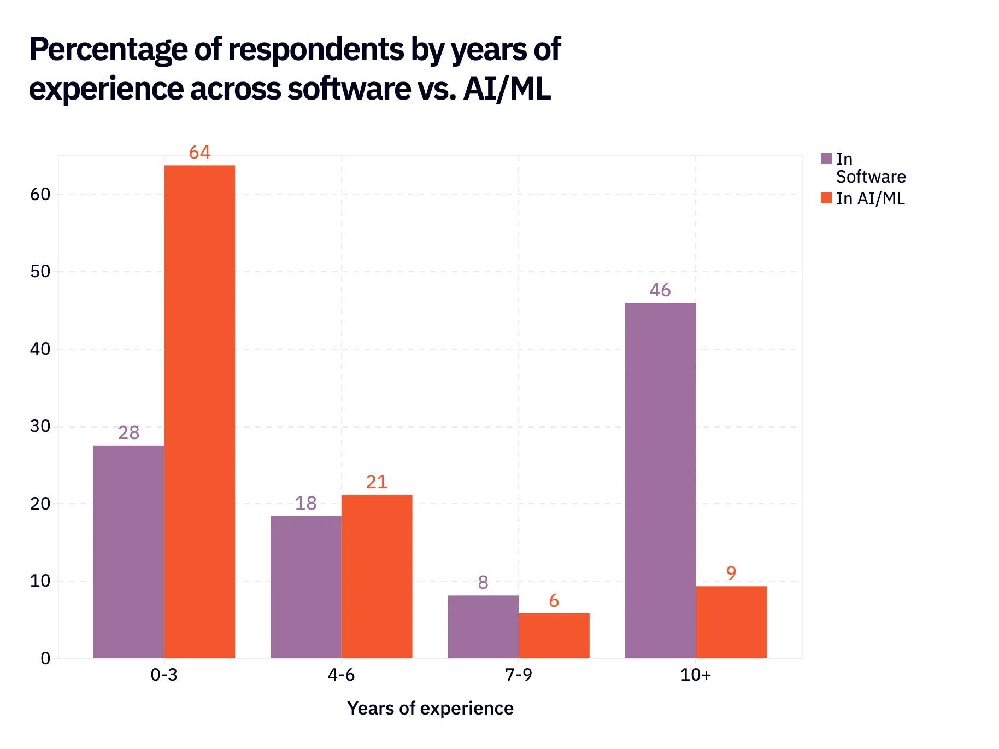

你可以把上图换个角度理解为"各经验段人群拥有多少年 AI/ML 经验？"，如下图所示。即便是拥有 10 年以上经验的资深工程师，其 AI/ML 经验的中位数也只有 3 年。

但如果看 0-3 年这一段，你会发现更年轻的软件工程师，*按其总软件经验的占比来看*，更加"AI 原生"。如果你现在才进入职场，那么软件工程经验*就是* AI/ML 经验。

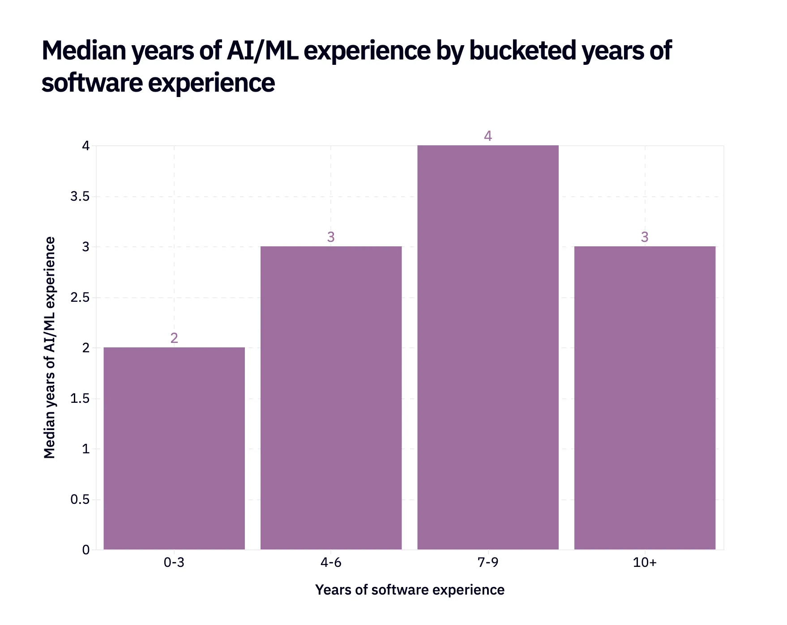

## 工作中的 AI（模型使用入门）

本节介绍受访者使用的模型类型及使用方式。

### 各模态在使用率和满意度上的差异

总体来看，所有模态的使用率都有显著提升（尤其是文本以外的模态——文本基本人人都在用）。请注意，受访者已经算是相当"AI 原生"的人群……但他们中的大多数仍未使用大部分模态。未来的增长空间依然惊人。

相比去年，最大的跃升来自图像生成。表示"正在使用图像生成 AI 且效果不错"的受访者翻了一倍（36% vs 2025 年的 18%）。许多最好的图像生成方案在过去 6-9 个月里发布了 V2 版本（如 NanoBanana 2、ChatGPT Images 2.0），看来正在收获成效。

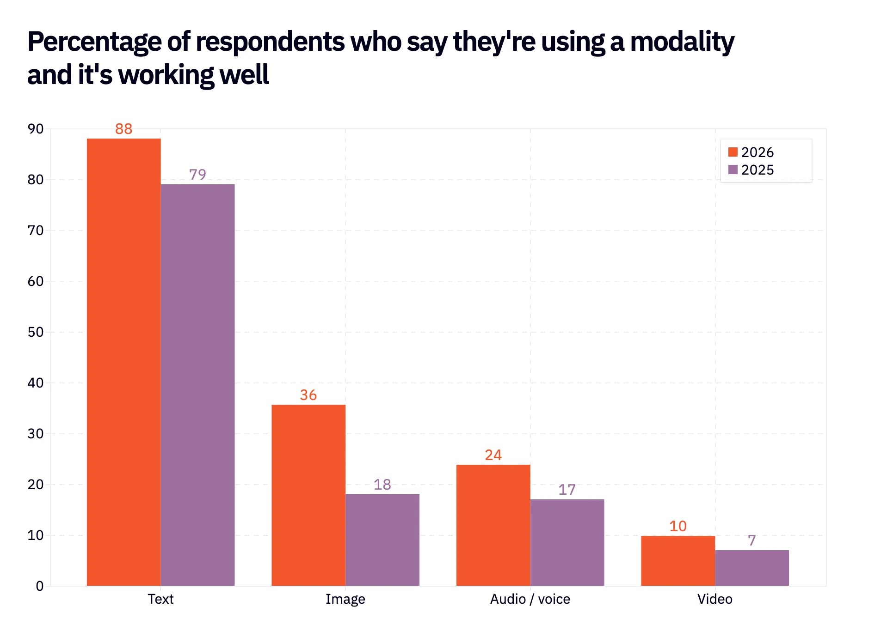

我们都在疑惑的一件事：**音频怎么了？** 去年我们认为音频即将迎来大规模采用；37% 未使用音频的受访者表示计划很快使用。此后确实有增长——24% 的受访者在愉快地使用音频，去年是 17%——但这并不是你预期的那种增长。不仅如此，音频的"采用意愿率"甚至比去年更高：56% 未使用音频的人计划很快使用。

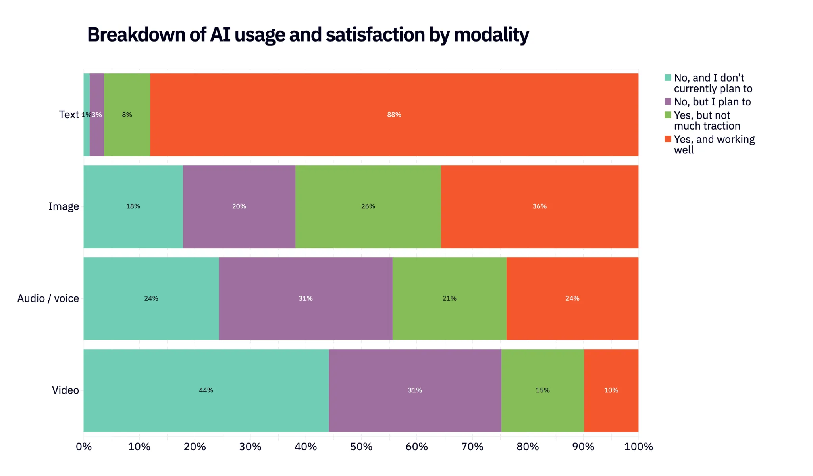

*是什么阻碍了人们用音频进行开发？*

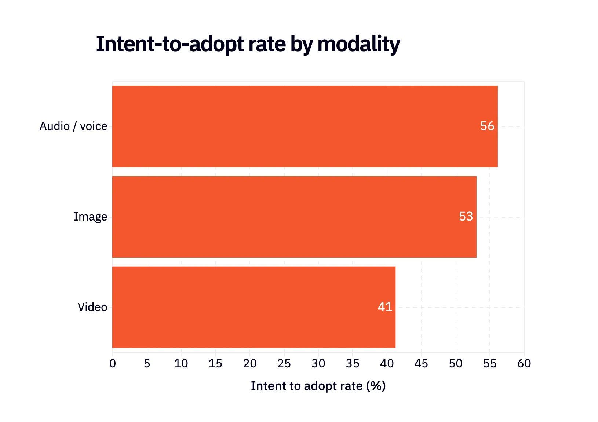

### 人们选择哪些模型，以及为什么

过去几个月关于开放权重模型的讨论很多。调研数据显示它们越来越受欢迎……但几乎没有人单独使用它们。如今开源最好被视为闭源的有益补充，而非直接替代。

在 45% 使用开放权重模型（开箱即用或微调）的受访者中，超过 90% 也在使用闭源模型。

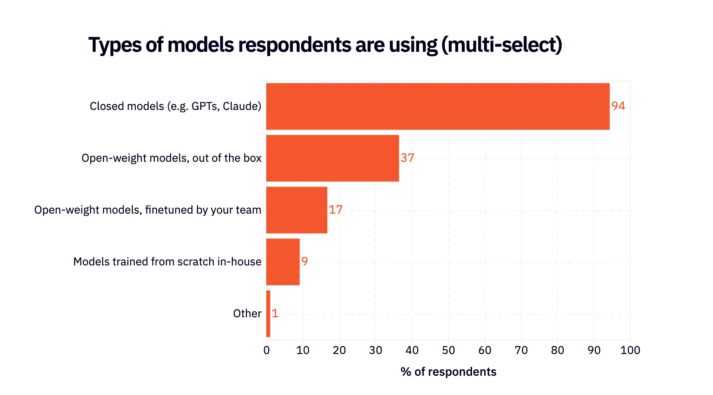

开源 vs 闭源其实只是 5% 受访者的首要考量。最重要的因素毫无悬念是……质量，其次是 Agent 能力，然后是成本（后文会再谈）。

只有 20% 的受访者把可靠性/可用性列入前三大考量。与每次 Claude Code 宕机时 X 上的舆论风暴相比，这是个有趣的数据点。

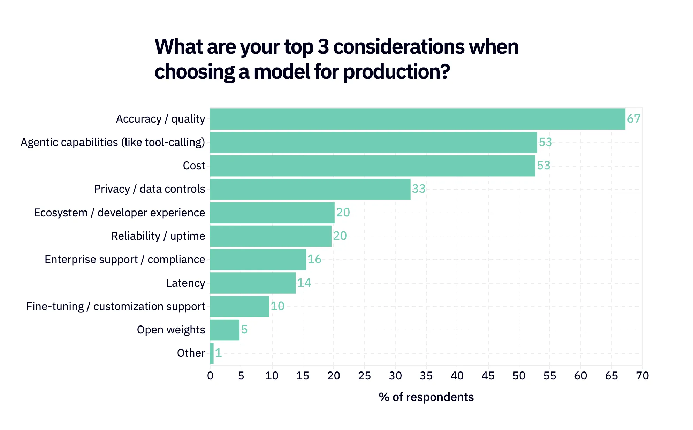

绝大多数受访者（87%）在同时使用多个模型。前三种路由方式是：44% 按任务类型路由，26% 同时运行多个模型并比较输出，11% 按成本路由。

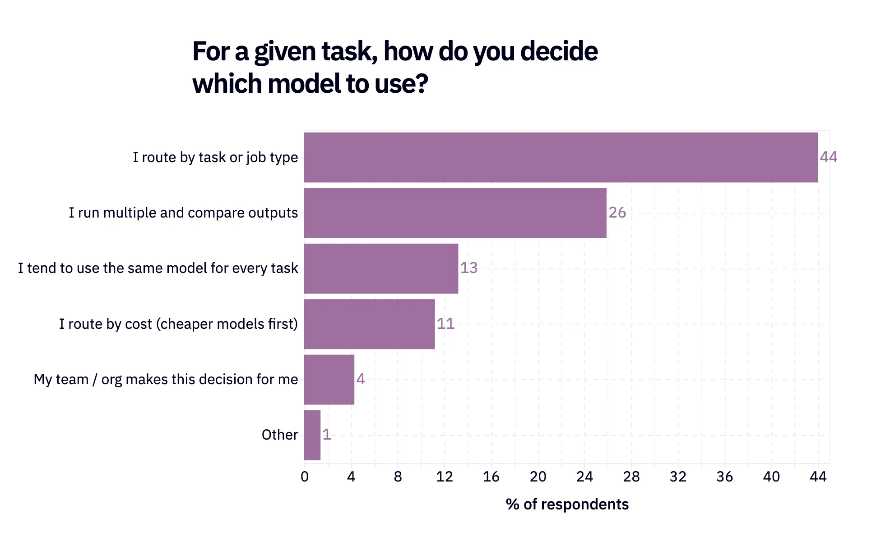

但这种"多元关系"可能不会持久。数据显示"大标准化"（The Great Standardization）可能即将到来：超过 50% 的受访者表示其组织内至少出现了向更少 AI 工具收敛的标准化趋势。

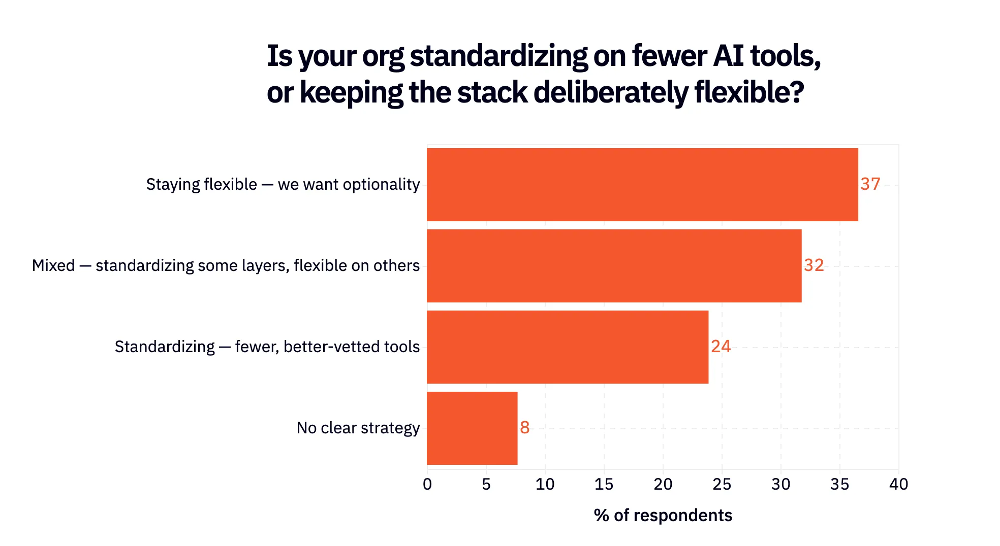

### 成本正成为一等公民

从主题上看，2025 年满是氛围（vibes）和纯粹的使用量，而 2026 年正在成为我们开始思考价值的一年。随着模型改进趋于平缓、价格持续上涨，成本开始在组织的 AI 决策中扮演重要角色。

40% 的受访者表示成本经常影响他们使用 AI 的雄心程度，36% 表示有时会。总的来说，四分之三的受访者会根据成本调整 AI 使用方式。

这听起来……显而易见，但如果你回到 12 个月前，情况绝非如此。

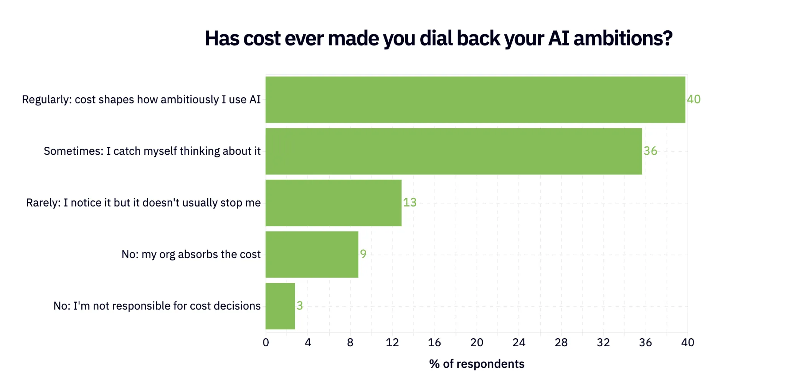

## Agent 写入数据与半自主之年（+监控）

Agent 在 2025 年还是个梗，到 2026 年已经成为 AI 的日常使用方式。Agent 的使用量相比去年几乎翻倍。在使用 Agent 的团队中，89% 表示其 Agent 可以写入数据，而去年是 52%。但大多数仍要求有人在环（human in the loop）。

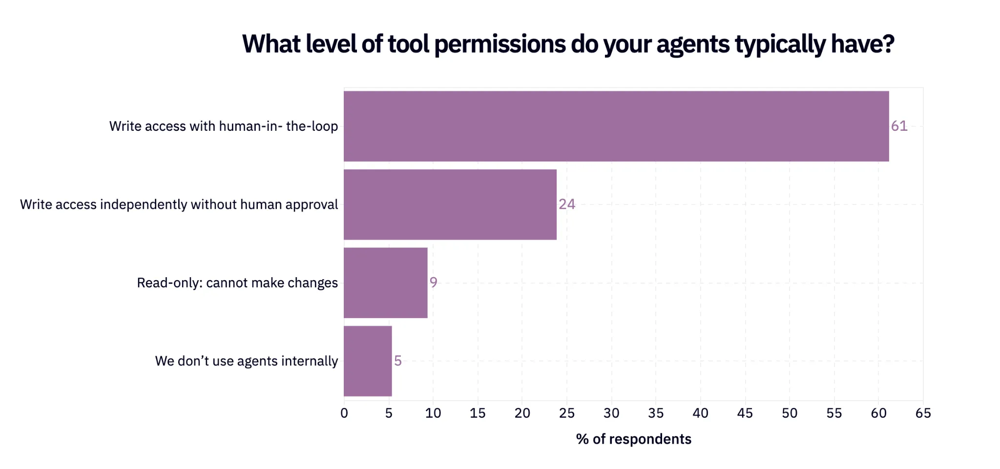

Agent 还不能完全放飞的部分原因在于，没人真正确定如何控制或管理它们。调研中排名前二的是我称之为相当原始的护栏——人在环审批，以及直接限制 Agent 的权限——其他策略的结果则很分散。大家基本上是什么都在尝试。

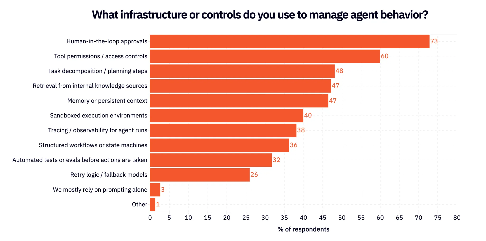

Agent 最容易出问题的地方是回答质量：61% 的人表示 Agent 最令人失望或沮丧的失败是幻觉（hallucination）。

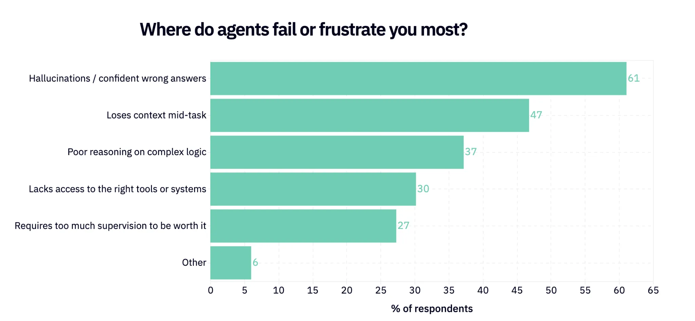

### 评估、监控与调整模型行为

成本的叙事仍在继续：成本是生产环境中被监控最多的指标之一（仅次于质量/任务成功率，这不废话嘛）。近一半的受访者在生产中主动监控成本。

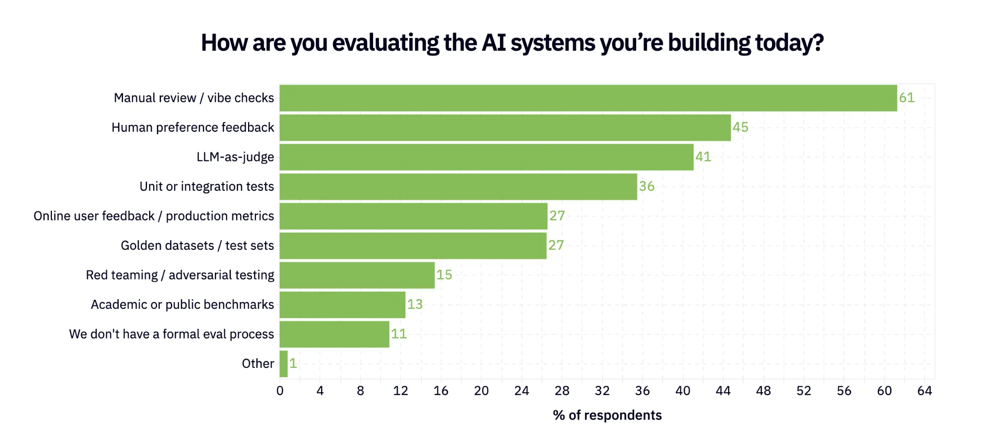

至于如何根据大家都在谈论的评估（evals）来实际调整模型行为，大多数受访者仍然（只是）在更新提示词。这开始显得有些原始，而且现在已经没人真正谈论提示词工程了。但现实就是如此。

另一个可能颠覆叙事的数据：近 50% 的受访者表示他们在使用某种形式的 RAG。

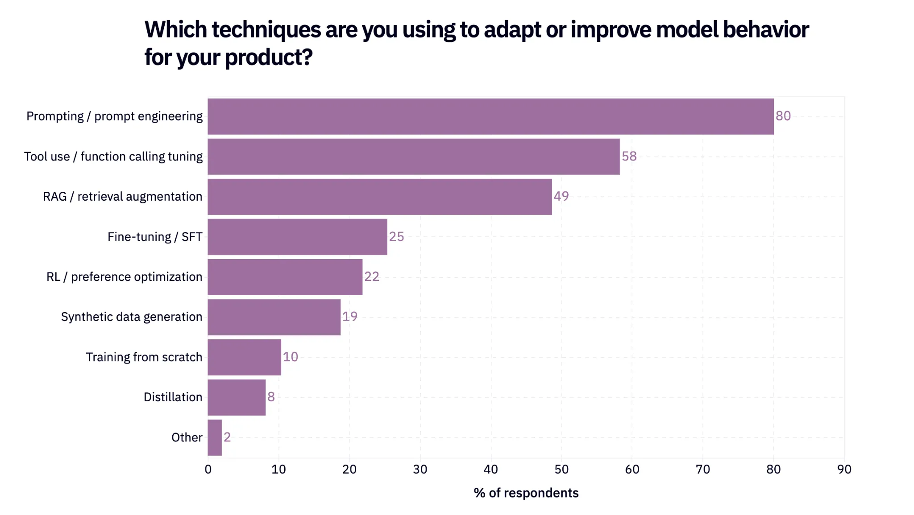

## AI 工程技术栈 + 自建 vs 采购

如果放眼整个 AI 工程技术栈，对于最大的挑战是什么并没有普遍共识。评估、编排与 Agent 逻辑、推理、安全在调研中的得分都相差无几。换句话说，我们还有很长的路要走（有整整 4% 的人认为技术栈运转良好 😂）。

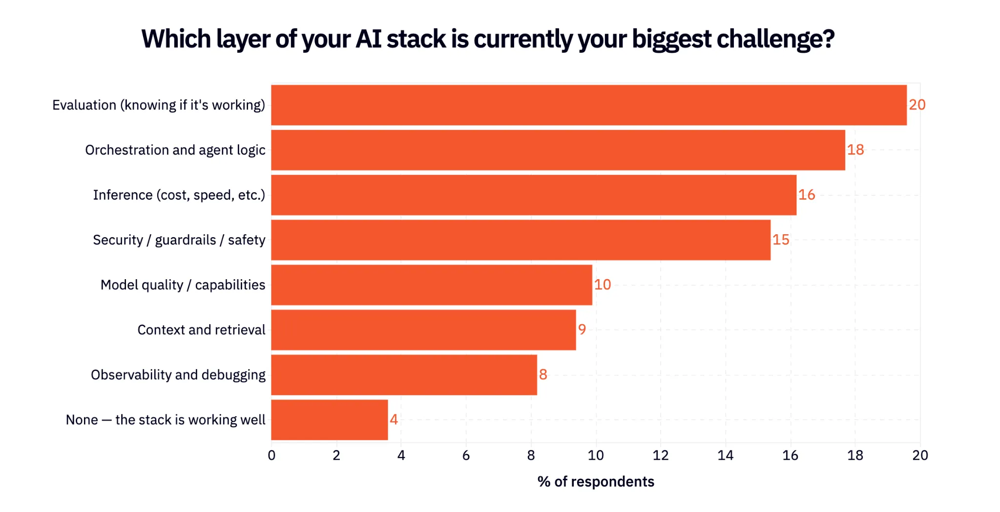

我们询问了受访者在技术栈不同层面上如何权衡自建与采购。他们可以标注在特定层面是自建还是采购，以及是否满意该决定或正在考虑切换（例如自建了微调，但正在考虑改为采购）。

最有趣的发现之一是：推理/模型服务是整个技术栈中最普遍采购的一层——45% 选择采购（调研中最高，其中 37% 对该决定满意），只有 23% 选择自建（调研中最低）。

提示词管理则恰恰相反。在技术栈所有层面中，它是最常自建、最少采购的一层。

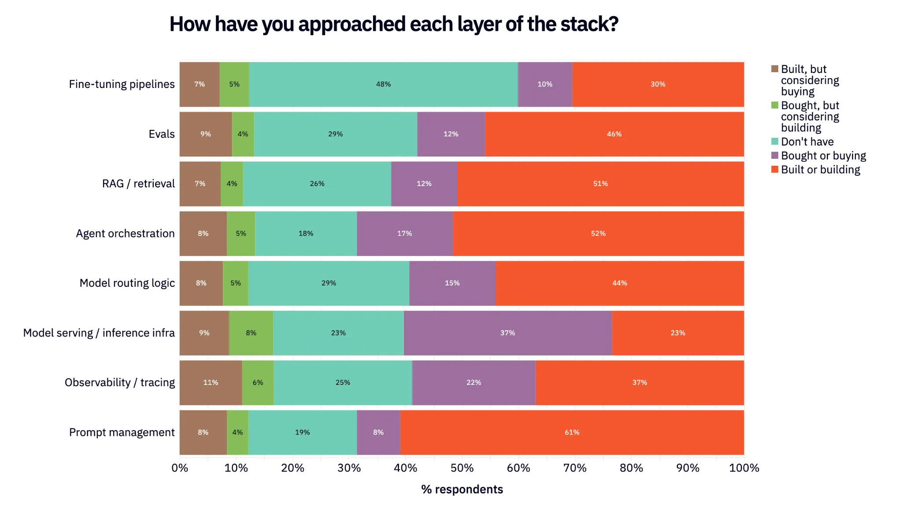

反过来，我们询问了 AI 对*他们自己的*开发技术栈影响最大的环节（可选前三项）。一个令人意外的结论是：AI 影响了软件工程栈的所有环节，而不仅仅是代码生成——近一半（48%）的人提到规划与规格撰写，甚至有 28% 的人提到后端/API。

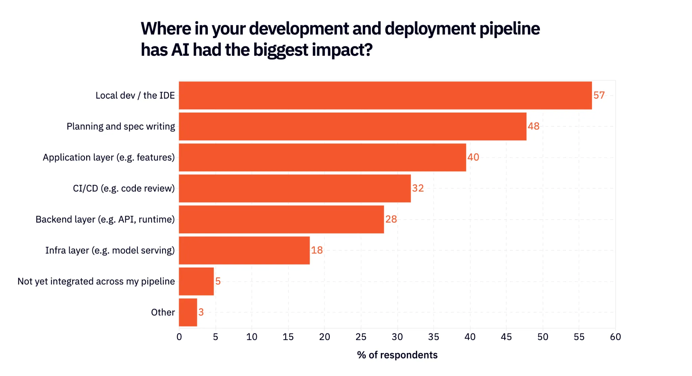

## 角色变迁与组织影响

我们清楚地看到，AI 正从实验性/折腾型技术转变为对组织具有广泛影响的技术。好消息是，几乎每位受访者（97%）都感受到了 AI 在组织中带来的正面连锁效应——主要体现在实验能力和更快的交付上。AI 黑子们要沉默了！

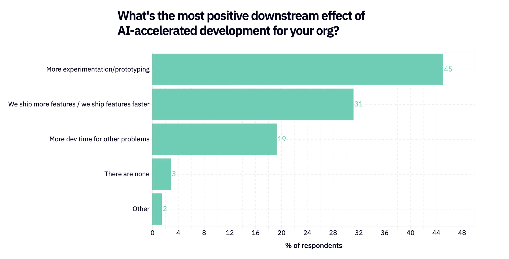

但每段风流韵事都有代价。93% 的受访者也感受到了负面连锁效应，其中最常见的是被广泛讨论的"深层技术能力与理解的侵蚀"。无限廉价的代码生成所带来的一切后果都体现在这里。

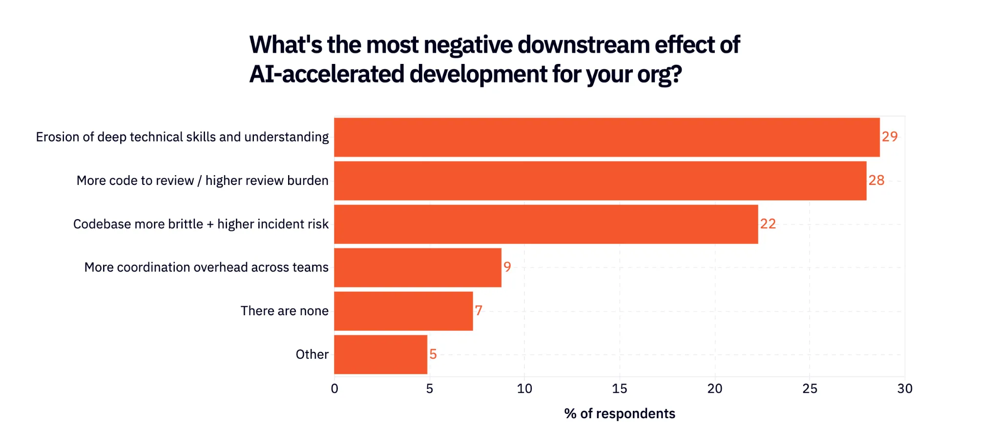

正因如此，产品组织中的传统角色边界已经在模糊。44% 的受访者表示这种情况正在显著发生，另有 37% 表示在一定程度上发生。

这一点在软件交付上感受最为强烈——这曾经是工程师的专属领域。近 50% 的受访者表示非开发人员至少在上线功能（多为内部功能）。但有 17% 表示非开发人员在常态化地上线完整的面向客户的功能，这让我大受震撼。而在那些尚未上线功能的大多数中，也有不少（32%）至少在内部构建有用的东西。

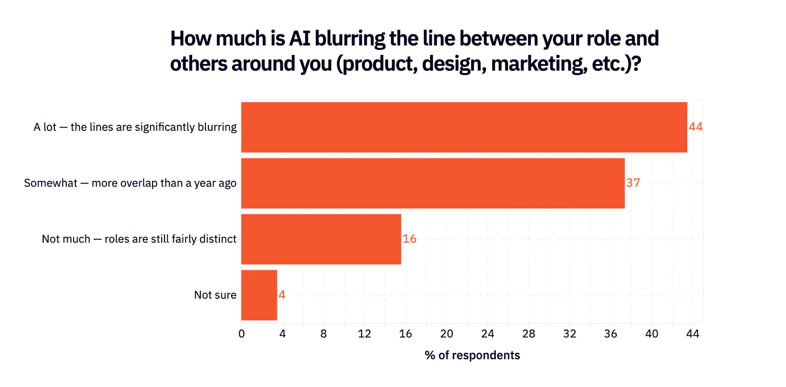

## 快问快答与预测

最后，我们请所有人对一些 AI 工程相关的基本观点表态：同意、不确定还是不同意。

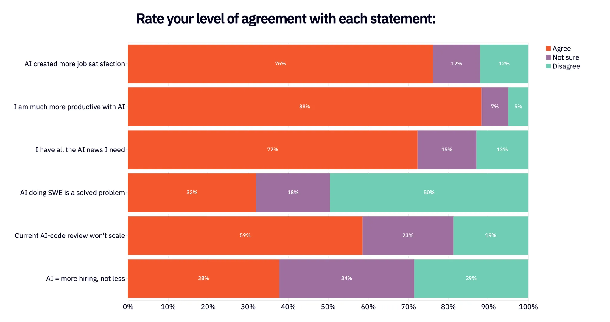

然后我们把同样的问题放到 5 年后。Agent 会做采购决策吗？SOTA 模型还会是闭源的吗？

除了"AI 生成 AI 研究想法"这一条，这些话题唯一的共同点是所有人的意见都严重分裂。只有 9% 的人押注 Transformer 五年后仍是最先进架构，大多数人不确定。我最喜欢的一条：太空中的 AI 算力会超过地面吗？36 人说会，38 人说不会。调研中最具争议的问题，真的是关于外太空的。

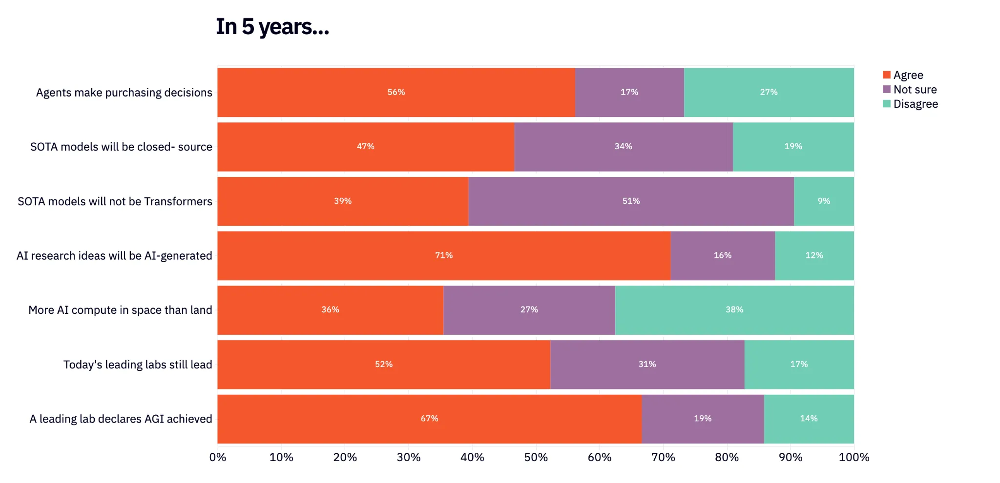

——

还想看哪些数据？明年我们该问哪些问题？欢迎通过[邮件](mailto:barr@amplifypartners.com)或 [X](https://x.com/barrnanas) 告诉我们。
